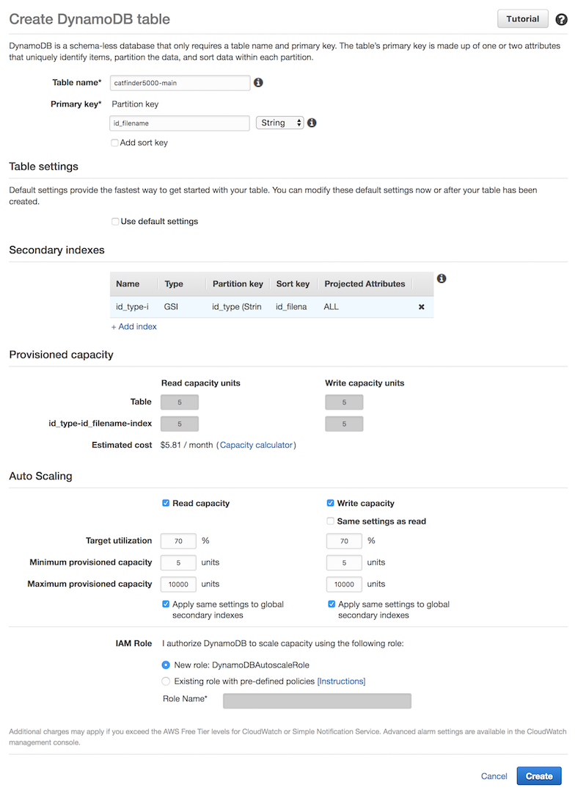
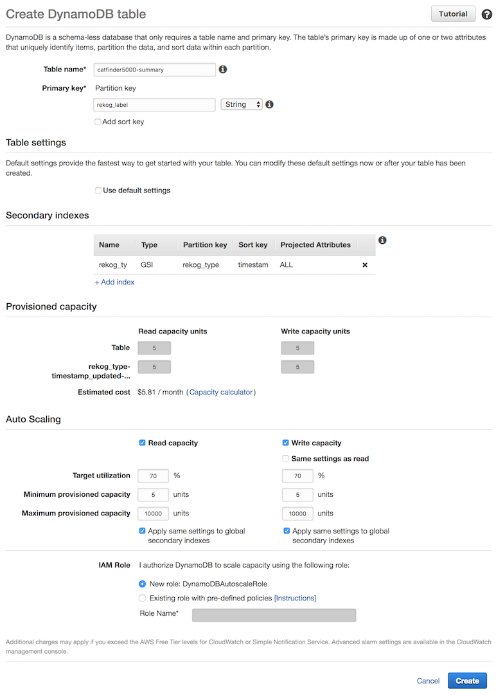
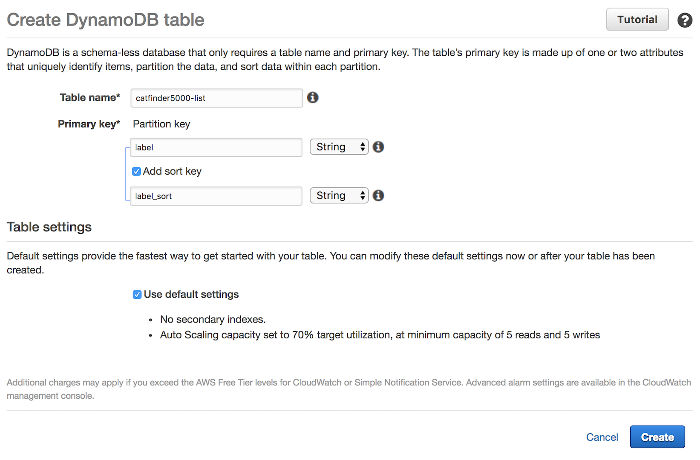

# Module 2: Amazon DynamoDB

In this module, you'll set up the Amazon DynamoDB tables for the backend Lambda Functions that will indexing your live stream.

## Browser

We recommend you use the latest version of Chrome to complete this workshop. You may use the latest version of Firefox and Safari, but the video.js player may not operate correctly and you won't be able to play video.

## 1. Create an Amazon DynamoDB Table "Main"

It is important that you use table names and key names exactly as stated in the instructions as they are referenced in the Lambda code as provided for you. You can override these via Environment Variables, but for the steps in this lab we will not exercise those changes.

### High-Level Instructions - Main Table

Use the DynamoDB console to create a new DynamoDB table. Call your table `catfinder5000-main` and give it a partition key called `id_filename` with type String. The table name and partition key are case-sensitive. Make sure you use the exact IDs provided. Use the defaults for all other settings.

### Step-by-step instructions - Main Table

1. Confirm you are in Oregon ( us-west-2 ) Region

1. From the AWS Management Console, on the **Services** menu, click **DynamoDB**.

1. Click **Create table**.

1. For **Table name**, enter `catfinder5000-main`. This field is case-sensitive.

1. For **Partition key**, enter `id_filename`, and then select **String** for the key type. This field is case-sensitive.
1. Under "Table Settings", clear **Use default settings**. ( uncheck the box )

1. Under "Secondary indexes", click **+ Add Index**.

    The Add Index dialog box displays.

1. For **Partition Key**, enter `id_type` and then select **String** for the key type. 

1. Select **Add Sort Key**.

1. For **Sort Key**, enter `id_filename` and then select **String** for the key type. 

1. For **Index Name**, confirm that `id_type-id_filename-index` appears.

1. For **Projected attributes**, select `All`. 

1. Click **Add Index**.

1. In the **Provisioned capacity** and **Auto Scaling** sections, leave the default configurations. 

1. Click **Create**.

### Result - Main Table

## 2. Create a DynamoDB Table - "Summary"

It is important that you use table names and key names exactly as stated in the instructions as they are referenced in the Lambda code as provided for you. You can override these via Environment Variables, but for the steps in this lab we will not exercise those changes.

### High-Level Instructions - Summary Table

Use the DynamoDB console to create a new DynamoDB table. Call your table `catfinder5000-summary` and give it a partition key called `rekog_label` with type String. The table name and partition key are case-sensitive. Make sure you use the exact IDs provided. Use the defaults for all other settings.

### Step-by-step instructions - Summary Table

1. From the AWS Management Console, on the **Services** menu, click **DynamoDB**.

1. Click **Create table**.

1. For **Table name**, enter `catfinder5000-summary`. This field is case-sensitive.

1. For **Partition Key**, enter `rekog_label` and then select **String** for the key type. This field is case-sensitive.

1. Under "Table Settings", clear  **Use default settings**. ( uncheck the box )

1. Under "Secondary indexes", Click  **"+ Add Index"**. The Add index dialog box displays.

1. For **Partition Key**, enter `rekog_type` and then select **String** for the key type. 

1. Select **Add Sort Key**.

1. For **Sort Key**, enter `timestamp_updated` and then select **Number** for the key type. 

    *Note:* the key type is "Number"

1. For **Index name**, confirm that `rekog_type-timestamp_updated-index` appears.

1. For **Projected attributes**, confirm that `All` appears.

1. Click **Add Index**.

1. Under **Provisioned capacity** and **Auto Scaling** sections, leave the default configurations. 

1. Click **Create**.

### Result - Summary Table

## 3. Create a DynamoDB Table - "List"

It is important that you use table names and key names exactly as stated in the instructions as they are referenced in the Lambda code as provided for you. You can override these via Environment Variables, but for the steps in this lab we will not exercise those changes.

### High-Level Instructions - List Table

Use the DynamoDB console to create a new DynamoDB table. Call your table `catfinder5000-list` and give it a partition key called `label` with type String and Primary Sort key called `label_sort` with type String. The table name and partition key are case-sensitive. Make sure that you use the exact IDs provided. Use the defaults for all other settings.

### Step-by-step instructions - List Table

1. From the AWS Management Console, on the **Services** menu, click **DynamoDB**.

1. Choose **Create table**.

1. For **Table name**, enter `catfinder5000-list` . This field is case-sensitive.

1. For **Partition key**, enter `label` and then select **String** for the key type. This field is case-sensitive.

1. Select **Add Sort Key**.

1. For **Sort key**, enter `label_sort` and then select **String** for the key type. This field is case-sensitive.

1. Under "Table Settings", leave **Use default settings** selected.

1. Click **Create**.

### Result - List Table

## Next Module

After you have successfully created your DynamoDB tables, you can move on to the next module, [Module 3: Lambda](../3_Lambda/README.md) where we add Lambda Funcations for the backend processes.

## Extra Credit

If you finished this like way too fast... Then we have something extra for you to do that isn't required to make the Lab run, but is neat to learn. Continue on to Module X: [Extra Credit](../X_ExtraCredit/README.md) if you have extra time to spare and only work on the Module section you have completed so far.