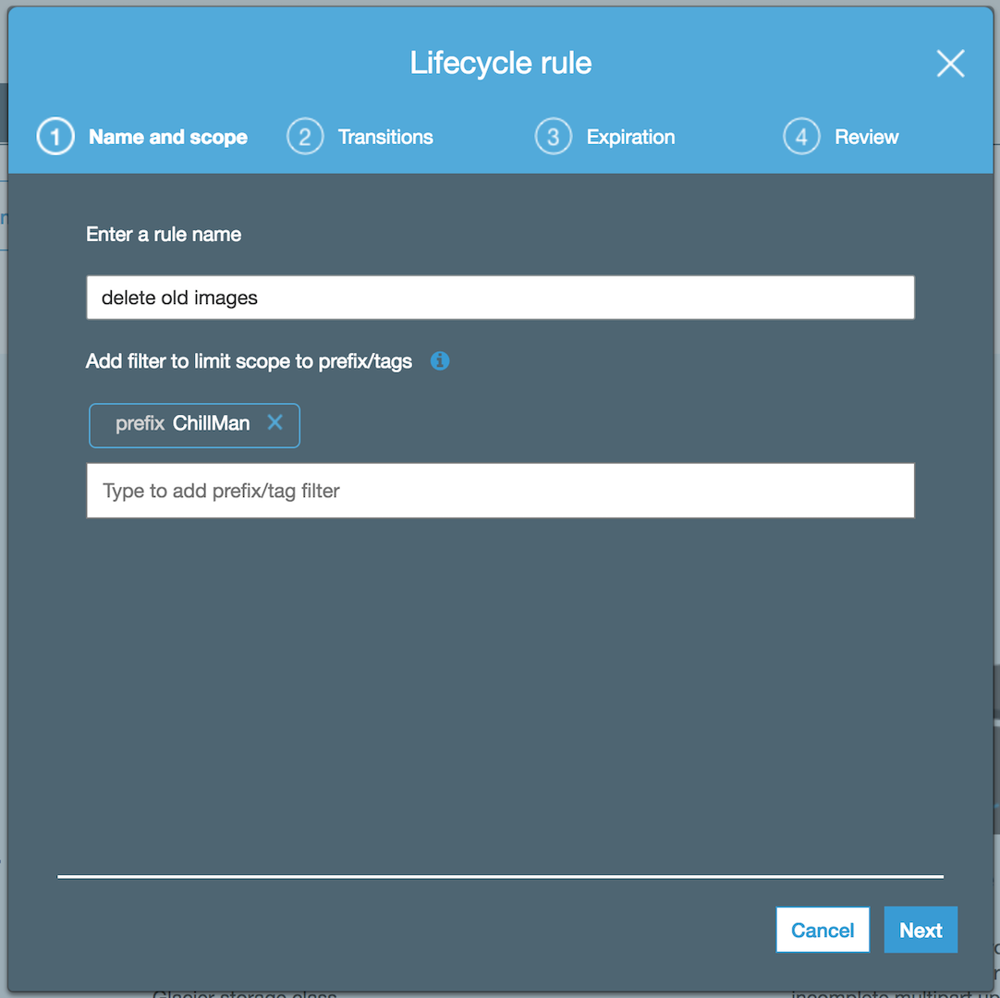

# Extra Credit

Since this workflow started out as a tradeshow demo, it was designed to run 24/7. If you look through the code, there is indication of any clean up on the jpgs and database would continue on forever. This is because I am using S3 Life Cycle Policy to clean up the jpgs, and "Time to Live attribute" in DynamoDB to delete all old content that isn't within the window of time the webpage is utlizing. 

## Module 1: Life Cycle Policy

### 1. Create Life Cycle Policy

#### High-Level Instructions

#### Step-by-step instructions - Life Cycle Policy

1. In the Amazon S3 console, select the name of the bucket you created in section 1.

1. Choose the **Management** tab, then choose **Lifecycle**.

1. Choose **+Add Life Cycle Rule**

    1. For **Enter a rule name** put "Delete all images after 1 day"

    1. For **Enter a rule name** put the root of the HLS filename from the HLS_URL from Module 3

        *Note:* it will be your team's name assigned to you for the [Team Cheatsheet](../teams.md)

        

1. Click **Next**

1. For *Configure transition* leave as Defaults and click **Next**

1. Check **Current Version**

1. Leave **Expire current version of object** 

1. Enter `1` for **days from object creation**

1. Click **Next**

    

1. After reviewing your configuration Click **Save**

## Module 2: TTL on DynamoDB Tables

DynamoDB has the ability to automatically delete entries from the table. You have to plan ahead and create a key/value pair that has a timestamp of when you would like the entry to be deleted. Since this was running as a 24/7 demo, I have already created this on each entry as `timestamp_ttl`

### Step-by-step instructions - DynamoDB Tables

1. From the AWS Management Console, on the **Services** menu, click **DynamoDB**.

1. Choose the `catfinder5000-main` table created in Module 2

1. Under **Tale Details" you will see "Time to live attribute	DISABLED"

1. Click **Manage TTL**

1. Enter `timestamp_ttl` in **TTL attribute**

1. Click **Continue**

1. Repeat this process for `catfinder5000-list`