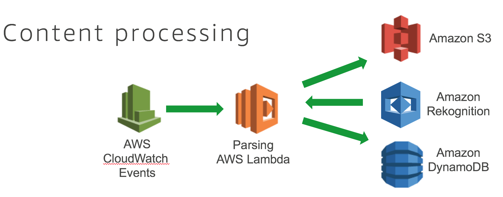

# catfinder5000-parse

## Overview

### Overview of “Parsing” lambda

CloudWatch triggers a parsing of the video URL every minute.
Get a time reference from Program-Date-Time information
Create a static JPG image from the scene in the video segment, stored in Amazon S3
Invoke Amazon Rekognition to tell what is on the scene, with what confidence level
Store the Time reference information, frame numbers and Delta URL in the Amazon DynamoDB

### Why I designed it this way

We are CURL-ing the file to local file system via a loop in a Lambda Function that CloudWatch Events is triggered every 1 minute. This design choice was to keep this lab condensed into the time allotted. It is not the most effecient way, just the easiest to keep this lab under 2.5 hours. A interesting side effect is this method could be used on a livestream on any origin/CDN. Other methods such as pushing HLS directly to a S3 bucket for S3 Event Triggers for Lambda Functions would require custom configurations for the Elemental Live encoder. Using this method helps keep our Lab within the correct span of time. 

## Code Steps

1. download m3u8s save to /tmp

1. parse m3u8s to get stream and time info

1. download .ts video file

1. ffprobe for PTS values and scene change analysis

1. ffmpeg for thumbnails of every frame to /tmp

1. identify each thumbnail for a scenechange indication

1. upload thumnail to S3 bucket

1. Rekognition anaylsis of thumbnail

1. if "person" label, use Celebrity Rekognition

1. put all info into DynamoDB

1. if "Cat" label detected invoke "prekog" Lambda Function

1. delete jpg and ts files

1. write json file from DynamoDB info

## Environment Variables

### Mandatory

*S3_BUCKET*

*HLS_URL*

### Optional

you can override the defaults listed below with the Enviornment Variable.

*DYNAMO_MAIN* = "catfinder5000-main"

*DYNAMO_LIST* = "catfinder5000-list"

*DYNAMO_SUMMARY* = "catfinder5000-summary"

*DYNAMO_SUMMARY_GSI* = 'rekog_type-timestamp_updated-index'

*LAMBDA_PREKOG* = "catfinder5000-prekog"

*REKOG_LABEL* = "Cat"