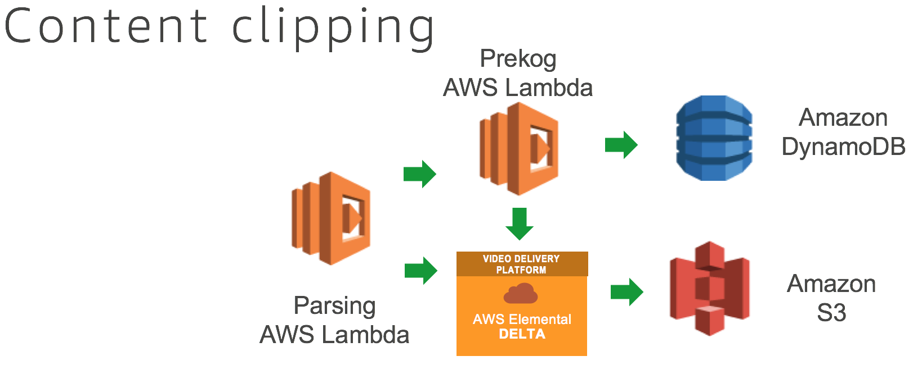

# catfinder5000-prekog

## Overview

### Overview of Prekog lambda

“Prekog” lambda script to:

1. Do the timing reconciliation (start/end) in the Dynamo DB

1. Put the media files and metadata in the S3 bucket (JSON format for easy representation)

### Why I designed it this way

This is a seperate Lambda Function from the "parse" so that it can be run in parallel each time a Rekognition Label that we want to create a Live to VOD asset is desired. Since the time for the end of the archive probably hasn't happened yet, I needed to create a secondary Lambda to continue to poll the database until the event has been satisfied and we get our cat video.

## Code Steps

1. start of archive

    1. get 1 entry before in DynamoDB 

    1. check to see if a "Cat" label exists

    1. check to see if scenechange confidence within threshold

    1. loop until those are met

    1. identify timestamp for start of archive

1. end of archive

    1. get 1 entry after in DynamoDB 

    1. check to see if a "Cat" label exists

    1. check to see if scenechange confidence within threshold

    1. loop until those are met

    1. identify timestamp for end of archive

1. send XML with start/end times to Delta REST

1. parse response to DyanamoDB table for website

## Environment Variables

### Mandatory

*DELTA_URL*

*DELTA_CONTENTNAME*

### Optional

*DYNAMO_MAIN* = "catfinder5000-main"

*DYNAMO_MAIN_GSI* = "id_type-id_filename-index"

*DYNAMO_LIST* = "catfinder5000-list"

*DYNAMO_SUMMARY* = "catfinder5000-summary"